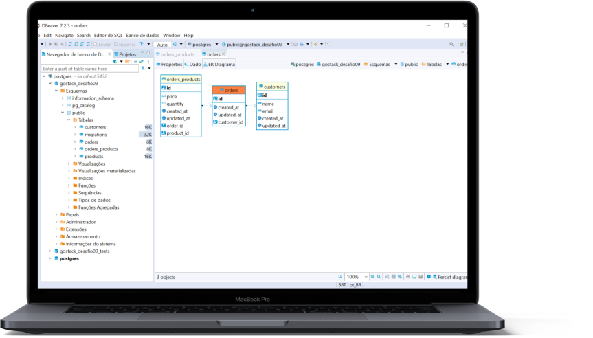

  <h1 align="center">
  Relacionamentos com banco de dados no Node.js
</h1>


  <p align="center">
    
  </p>

<h3 align="center">
  Foi desenvolvido o back-end de uma aplicação que deve permitir a criação de clientes, produtos e pedidos e o cliente pode gerar novos pedidos de compra de certos produtos, como um pequeno e-commerce.
</h3>

<p align="center">
  

  

  
</p>

<p align="center">
  <a href="#funcionalidades">Funcionalidades</a>&nbsp;&nbsp;&nbsp;|&nbsp;&nbsp;&nbsp;
  <a href="#heavy_check_mark-configurações-necessárias">Configurações necessárias</a>&nbsp;&nbsp;&nbsp;|&nbsp;&nbsp;&nbsp;
  <a href="#arrow_down_small-clonando-o-repositório">Clonando o repositório</a>&nbsp;&nbsp;&nbsp;|&nbsp;&nbsp;&nbsp;
  <a href="#beginner-iniciando-a-aplicação">Iniciando a aplicação</a>&nbsp;&nbsp;&nbsp;|&nbsp;&nbsp;&nbsp;
  <a href="#wrench-tecnologias--ferramentas--recursos">Tecnologias | Ferramentas | Recursos</a>&nbsp;&nbsp;&nbsp;|&nbsp;&nbsp;&nbsp;
  <a href="#memo-license">Licença</a>
</p>

Durante as aulas do [RocketSeat GoStack Bootcamp](https://rocketseat.com.br/bootcamp) foram aprendidos conteúdos relacionados a Node.js junto ao TypeScript, incluindo o uso de banco de dados com o TypeORM e relacionamentos ManyToMany. Para treinar o que foi aprendido até o momento foi desenvolvido o back-end de uma aplicação que permite a criação de clientes, produtos, pedidos de compras com vários produtos.

### Funcionalidades

- Cadastro de novos clientes;
- Cadastro de novos produtos;
- Criação de pedidos com um ou vários produtos;
- Atualização da quantidade de produtos quando for realizado um pedido;
- Listagem de pedido.

### :heavy_check_mark: Configurações necessárias

Seguem as configurações neessárias para visualizar a aplicação em sua máquina.

-  [Git](https://git-scm.com);
-  [Node](https://nodejs.org/);
-  [Yarn](https://yarnpkg.com/).

### :arrow_down_small: Clonando o repositório
1. Pelo terminal, acesse o diretório em que deseja ter o repositório clonado e execute o comando a seguir.
```bash
# clonando o repositório
git clone https://github.com/belapferreira/database-relations
```

### :beginner: Iniciando a aplicação
1. Pelo terminal, acesse o diretório clonado e execute o comando abaixo.
```bash
# instalando as dependências
yarn install
```
### :mag: Realizando os testes
1. Foi usado um template que contém testes para orientar o que esperava-se dos blocos de códigos a serem programados;
</br>
2. Crie os banco de dados "gostack_desafio09" (acesso o arquivo "ormconfig.json" para verificar outras informações) e "gostack_desafio09_tests" e conecte a aplicação a eles para que todos os testes possam executar corretamente;
</br>
3. Para verificar se qualquer alteração realizada atende aos requisitos solicitados, acesse o terminal e execute o seguinte comando:
```bash
# testando atendimento aos requisitos
yarn test
```

### :wrench: Tecnologias | Ferramentas | Recursos

Esse projeto foi desenvolvido utilizando os seguintes recursos:

-  [Eslint](https://eslint.org/);
-  [Jest](https://jestjs.io/);
-  [Prettier](https://prettier.io/);
-  [Supertest](https://www.npmjs.com/package/supertest);
-  [Tsconfig Path](https://www.npmjs.com/package/tsconfig-paths);
-  [TypeScript](https://www.typescriptlang.org/).

### :memo: License
Esse projeto está sob MIT license. Veja [LICENSE](https://github.com/belapferreira/database-relations/blob/master/LICENSE) para mais informações.

---

Feito por Bela Ferreira :blue_heart: Contato: https://www.linkedin.com/in/belapferreira :blush:
